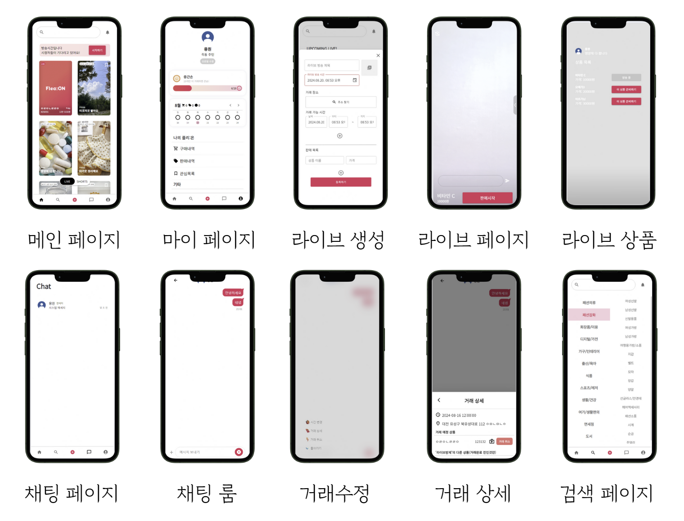

# Flea:ON


# 1. **프로젝트 개요**

프로젝트명 : Flea:ON (플리온)

설명 : WebRTC 기술을 접목하여 일반인 누구나 쉽게 라이브 방식으로 중고 물품을 판매하고 구매할 수 있는 초대형 중고 라이브 커머스 플랫폼입니다.

---

# 2. **목차 (Table of Contents)**

- [프로젝트 설명](#3-프로젝트-설명)
- [설치 방법](#4-설치-방법-installation)
- [사용 방법](#5-사용-방법-usage)
- [환경 설정](#6-환경-설정-configuration)
- [배포](#7-배포-deployment)
- [기술 스택](#8-기술-스택-technologies-used)
- [프로젝트 일정 및 산출물](#9-프로젝트-일정-및-산출물)
- [회고](#10-회고)

---

# 3. 프로젝트 설명

### **서비스 소개**

**“판매자는 적은 이동 비용으로 판매할수 있게 도와주고 구매자는 싼값에 구매할 수 있게 하겠다.”** 라는 취지에서 시작한 초대형 라이브 커머스 플랫폼입니다. 

**핵심 가치**

- 간편함: 쇼호스트 없이도 누구나 쉽게 라이브 판매!
- 신속함: 라이브 커머스 방식으로 빠른 판매 및 구매!!
- 저렴함: 끌어 올리기 시 할인된 가격으로 저렴한 가격에 상품 구매!!!
- 편리함: 판매 도우미 챗봇 지원, 거래 장소 및 시간 자동 정리!!!!
- 재미: 숏폼 콘텐츠 제작 및 다음 상품 버튼으로 재미있는 쇼핑 경험 제공!!!!!

### **기획 배경**

2022년 하반기 조사에서 중고거래 플랫폼 이용률은 60%

→ 기존 어플들 로고 띄우고 그 주변으로 대량 중고 거래 예시 사진들 띄우기

중고제품 판매 이유는 ‘불필요한 물품 정리’ ‘그냥 버리기엔 아까워서’가 많았으며, 구매 이유는 ‘저렴한 가격’ ‘새상품 구매 부담’ 순

“중고거래의 가장 큰 불편함이 대면거래와 거래 준비 과정이 가장 많은 비율을 차지했다. 이점을 해소하기 위한 방법이 필요했다.”

**소비자 불편사항 : 팔 때는 거래 준비과정, 살 때는 품질과 사기거래**

### **개발 멤버**

BE : 박민지, 라송연

Infra : 김용원 

FE : 윤채영, 구고운, 김해인

### 주요 기능

1. **라이브 판매**
    - 일반 사용자가 쇼핑 앱을 통해 간편하게 라이브 판매 방송 가능
    - 예약제로 구매 우선권 제공
    - 판매 도움 봇을 통한 예약자 관리 및 상품 정보 제공
        - 상품 추가 구매, 구매 취소, 날짜 및 시간 변경
    - 욕설, 비방어 채팅 금지
    - 이벤트성 무료 나눔 진행
2. **숏폼 콘텐츠**
    - 상품별 숏폼 콘텐츠로 변환
    - 숏폼 스크랩 기능
    - 숏폼에 대한 AI 요약 제공
3. **사용자 개인화**
    - 관심사 등록한 물품(숏폼)과 라이브의 알림 기능
    - 회원 등급 시스템 (애기손, 작은손, 중간손, 큰손)
    - 사용자의 관심 지역 위주 숏폼 추천
4. **기타**
    - 상품 카테고리 정보 자동 입력 기능 (네이버 쇼핑 API 사용)
    - 구매자측에서 특별히 채팅을 신청하지 않는 한, 단순 버튼 선택으로 거래일정 조율 및 취소, 추가 가능 ⇒ 사용자의 채팅 부담 완화
        - 거래 상세, 취소, 추가 구매, 예약, 거래 파기 가능
    - 거래 일정 캘린더 자동 생성
        - 거래 확정 가능 → 거래 확정 시 상품 관련 데이터 모두 삭제, 라이브 내의 물건이 모두 판매 완료될 시 라이브 관련 데이터 모두 삭제

### **발표 자료 및 UCC**


### [UCC링크 바로가기](https://youtu.be/iTAEV9bgJDQ)


### [발표자료](https://www.canva.com/design/DAGN9S56lmQ/8MEObsYTPAdDVw2l7tl7kw/view?utm_content=DAGN9S56lmQ&utm_campaign=designshare&utm_medium=link&utm_source=editor)

# **4. 설치 방법 (Installation)**

프론트 엔드 실행

```bash
cd frontend
npm i --force
npm start
```

백엔드 실행

```bash
cd backend
./gradlew clean build
cd build/libs
java -jar *.jar
```

openvidu 2.30 - onpremiss버전 실행 

# 5. **사용 방법 (Usage)**

- [https://www.fleaon.shop](https://www.fleaon.shop) (배포 중지)

# 6. **환경 설정 (Configuration)**

### [application.properties]

```java
spring.datasource.driver-class-name=com.mysql.cj.jdbc.Driver
spring.datasource.url=jdbc:mysql://i11b202.p.ssafy.io:3306/ssafy_web_db?serverTimezone=Asia/Seoul&useUnicode=true&characterEncoding=UTF-8
spring.datasource.username=${DB_PASSWORD}
spring.datasource.password=${DB_PASSWORD}

spring.config.import=optional:file:.env[.properties]

server.port=${SERVER_PORT}
server.ssl.enabled=false
openvidu.url=${OPENVIDU_URL}
openvidu.secret=${OPENVIDU_SECRET}
server.domain=${SERVER_DOMAIN}
spring.mvc.converters.preferred-json-mapper=gson

spring.jpa.hibernate.ddl-auto=update
spring.jpa.hibernate.naming.physical-strategy=org.hibernate.boot.model.naming.PhysicalNamingStrategyStandardImpl

spring.jwt.secret=${SPRING_JWT_SECRET}

spring.servlet.multipart.max-file-size=10MB
spring.servlet.multipart.max-request-size=10MB

# JVM ??? ?? (?: Asia/Seoul)
 spring.jpa.properties.hibernate.jdbc.time_zone=Asia/Seoul

#redis
spring.data.redis.host=i11b202.p.ssafy.io
spring.data.redis.port=6379
spring.data.redis.password=${DB_PASSWORD}
spring.data.redis.timeout=2000

logging.level.org.springframework.security=DEBUG

#registration
spring.security.oauth2.client.registration.naver.client-name=naver
spring.security.oauth2.client.registration.naver.client-id=${NAVER_CLIENT_ID}
spring.security.oauth2.client.registration.naver.client-secret=${NAVER_CLINET_SECRET}
spring.security.oauth2.client.registration.naver.redirect-uri=${SERVER_DOMAIN}/login/oauth2/code/naver
spring.security.oauth2.client.registration.naver.authorization-grant-type=authorization_code
spring.security.oauth2.client.registration.naver.scope=name,email,nickname,profile_image

#provider
spring.security.oauth2.client.provider.naver.authorization-uri=https://nid.naver.com/oauth2.0/authorize
spring.security.oauth2.client.provider.naver.token-uri=https://nid.naver.com/oauth2.0/token
spring.security.oauth2.client.provider.naver.user-info-uri=https://openapi.naver.com/v1/nid/me
spring.security.oauth2.client.provider.naver.user-name-attribute=response

#registration
spring.security.oauth2.client.registration.google.client-name=google
spring.security.oauth2.client.registration.google.client-id=${GOOGLE_CLIENT_ID}
spring.security.oauth2.client.registration.google.client-secret=${GOOGLE_CLIENT_SECRET}
spring.security.oauth2.client.registration.google.redirect-uri=${SERVER_DOMAIN}/login/oauth2/code/google
spring.security.oauth2.client.registration.google.authorization-grant-type=authorization_code
spring.security.oauth2.client.registration.google.scope=profile,email

#provider
spring.security.oauth2.client.provider.kakao.authorization-uri=https://kauth.kakao.com/oauth/authorize
spring.security.oauth2.client.provider.kakao.token-uri=https://kauth.kakao.com/oauth/token
spring.security.oauth2.client.provider.kakao.user-info-uri=https://kapi.kakao.com/v2/user/me
spring.security.oauth2.client.provider.kakao.user-info-authentication-method=header
spring.security.oauth2.client.provider.kakao.user-name-attribute=id

#registration
spring.security.oauth2.client.registration.kakao.client-id=${KAKAO_CLIENT_ID}
spring.security.oauth2.client.registration.kakao.client-secret=${KAKAO_CLIENT_SECRET}
spring.security.oauth2.client.registration.kakao.client-authentication-method=client_secret_post
spring.security.oauth2.client.registration.kakao.authorization-grant-type=authorization_code
spring.security.oauth2.client.registration.kakao.scope=profile_nickname,profile_image, account_email
spring.security.oauth2.client.registration.kakao.redirect-uri=${SERVER_DOMAIN}/login/oauth2/code/kakao
spring.security.oauth2.client.registration.kakao.client-name=Kakao

```

# 7. **배포 (Deployment)**

- jenkins를 통해 gitlab에 frontend branch에 merge가 발생한 경우
    - 깃랩에서 코드를 가져와 backend코드를 clone하여 build한 후 빌드 파일을 도커 허브에 push함
    - 백엔드 서버에서 도커 컴포즈로 turn서버, proxy서버(nginx), redis, db, 백엔드 서버를 통합하여 실행
- jenkins를 통해 gitlab에 frontend branch에 merge가 발생한 경우
    - 깃랩에서 코드를 긁어와 front코드를 clone하여 도커파일로 만들어 도커허브에 push함
    - 프론트 서버에서 도커허브에 우리 front 프로젝트를 pull받은 후 실행

# 8. **기술 스택 (Technologies Used)**

### [ Front ]

- Visual Studio Code IDE
- React 10.8.1
- HTML5, CSS3
- Node.js 20.15.0

### **[ Back ]**

- IntelliJ IDE
- SpringBoot 3.3.2 (JDK 17.0.10)
- SpringSecurity

### **[ DB ]**

- MySQL 8.0.37
- Redis
- Firebase

### **[ Infra ]**

- ****Docker
- Jenkins
- Nginx
- WebRTC
- OpenVidu
- AWS EC2

# 9. 프로젝트 일정 및 산출물

- 프로젝트 사진 첨부 (페이지 별)
- 메인 화면 - 라이브
    - 사용자가 선택한 선호지역에서 거래가 가능한 라이브와 방송 예정인 라이브를 보여줍니다.
    - 검색 기능을 통해서 구매하고 싶은 상품의 이름을 검색하면 해당 상품이 포함된 방송 예정, 라이브 중인 방송을 보여줍니다.
    - 카테고리를 선택하면 해당 카테고리에 해당하는 상품이 팔리고 있는 방송 예정, 현재 라이브 중인 방송을 보여줍니다.
    - 라이브를 스크랩할 수 있습니다.
    - 스크랩한 라이브에 대한 알람을 받을 수 있습니다.
    - 방송 예정인 라이브를 누르면 상세보기가 가능합니다.
- 메인 화면 - 쇼츠
    - 사용자가 선택한 선호지역에서 거래가 가능한 쇼츠를 보여줍니다.
    - 검색 기능을 통해서 구매하고 싶은 상품의 이름을 검색하면 해당 상품이 포함된 쇼츠를 보여줍니다.
    - 카테고리를 선택하면 해당 카테고리에 해당하는 상품이 팔리고 있는 쇼츠를 보여줍니다.
    - 쇼츠를 스크랩할 수 있습니다.
    - 무한 스크롤로 쇼츠를 볼 수 있습니다.
- 라이브 생성
    - 썸네일을 설정할 수 있습니다.
    - 라이브 제목을 설정할 수 있습니다.
    - 거래 가능한 장소를 카카오 맵을 통해서 검색할 수 있습니다.
    - 거래 가능한 시간을 설정할 수 있습니다.
    - 판매하고자 하는 물품들을 추가할 수 있습니다.
    - 모든 정보로 라이브를 생성할 수 있습니다.
- 라이브
    - 카메라 전환을 통해서 전면, 후면 방송을 모두 가능하게 합니다.
    - 실시간 채팅이 가능합니다.
    - 채팅에 욕설, 비방하는 언어가 나타나면 감지하여 안내 문구를 보여줍니다.
    - 구매하기 버튼을 누르면 거래를 원하는 시간을 설정할 수 있습니다.
- 채팅
    - 챗봇과 간단한 채팅으로 상품 추가 구매, 구매 취소, 날짜 및 시간 변경을 쉽게 할 수 있습니다.
    - 구매자와 판매자간의 채팅도 가능합니다.
- 마이페이지
    - 회원 정보를 수정할 수 있습니다.
    - 개인 거래 일정을 관리할 수 있습니다.
    - 해당 날짜의 거래를 누르면 상세보기가 가능합니다.
    - 스크랩한 라이브, 쇼츠를 볼 수 있습니다.
- 알림
    - 방송 시작 알림을 받을 수 있습니다.
- 검색
    - 키워드로 검색이 가능합니다.
    - 카테고리별로 검색이 가능합니다.

# 10. 회고

- 박민지
    
    이번 프로젝트에서는 **라이브 커머스 플랫폼**을 안정적으로로 구축하는 데 중점을 두었습니다. **Spring Boot, MySQL, Redis** 등 다양한 기술 스택을 활용하여 핵심 기능을 구현했고, 특히 Redis로 MessageQueue를 구현하여 동시성 제어를 강화했습니다. 
    
    향후 개선점으로는 **부하 테스트 및 성능 최적화**,  **코드 복잡성 관리**가 필요하며, 문서화를 더욱 강화할 계획입니다. 이번 프로젝트는 팀 간 협업의 중요성을 다시 한번 느끼게 한 값진 경험이었습니다.
    
- 김용원
    
    프로젝트에서 처음으로 인프라를 경험해봐서 여러가지 시행착오를 많이 겪었지만 그만큼 많이 배우게 되었고 nignx나 docker-compose 등 새로운 기술들을 많이 경험해 보면서 시야가 넓어졌습니다. 
    
- 라송연
    
    이번 flea:On 프로젝트에서 OAuth2를 이용해서 소셜 로그인을 구현했습니다. 개인의 프로필을 가져와 회원가입과 로그인을 할 수 있도록 구현했고, JWT 토큰을 이용해서 인증하는 방식을 구현했습니다. 
- 윤채영
- 구고운
- 김해인